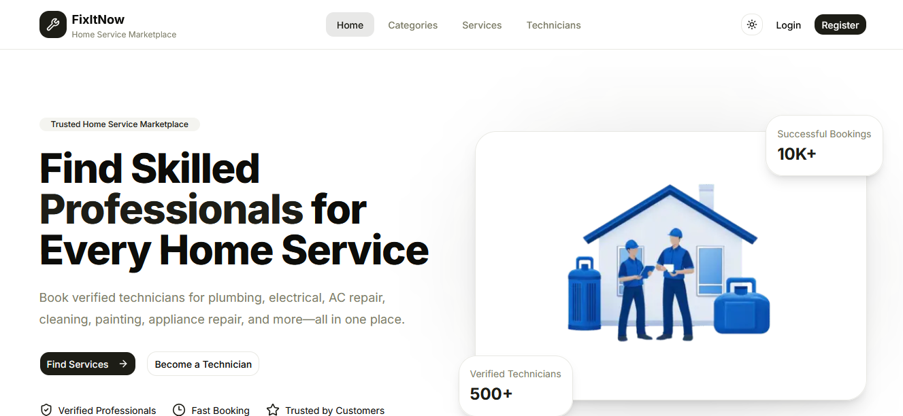

# 🔧 FixItNow – Home Service Marketplace

A modern full-stack home service marketplace that connects customers with skilled technicians for booking home services such as electrical work, plumbing, appliance repair, and more.

The platform supports role-based authentication for **Customers**, **Technicians**, and **Administrators**, providing a complete service booking and management experience.

## 🌐 Live Demo

👉 **Frontend:** https://fixitnow-frontend-jade.vercel.app/

## 📦 Backend Repository

👉 **Backend API:** https://github.com/AbuShahma022/assignment-4

---

# ✨ Features

## 🌍 Public

- Browse service categories
- Explore available services
- View technician profiles
- Become a technician application
- Responsive UI
- Search-friendly layout

## 👤 Authentication

- User Registration
- User Login
- Secure Logout
- JWT Authentication
- HTTP-only Cookie Authentication
- Automatic Access Token Refresh
- Protected Routes
- Role-based Authorization

## 👥 Customer

- Book technician services
- View booking history
- Cancel bookings
- Secure Stripe Checkout
- Payment history
- Leave reviews and ratings

## 🛠 Technician

- Create technician profile
- Update technician profile
- Manage offered services
- Manage availability schedule
- Receive booking requests
- Accept / Decline bookings
- Mark bookings as In Progress
- Complete bookings
- Create service requests
- View submitted service requests

## 🛡 Admin

- Dashboard overview
- User management
- Category management
- Master service management
- Service request approval/rejection
- Booking monitoring
- Payment monitoring

---

# 🧰 Tech Stack

## Frontend

- Next.js 15
- React 19
- TypeScript
- Tailwind CSS
- shadcn/ui
- React Query (TanStack Query)
- React Hook Form
- Zod
- Axios
- Day.js
- Sonner

## Backend

- Node.js
- Express.js
- TypeScript
- Prisma ORM
- PostgreSQL
- JWT Authentication
- Stripe Payment Gateway
- Zod Validation

---

# 📁 Project Structure

```text
app/
components/
hooks/
services/
types/
validations/
shared/
```

---

# 🚀 Getting Started

## Clone the repository

```bash
git clone https://github.com/AbuShahma022/fixitnowfrontend.git
```

## Install dependencies

```bash
npm install
```

## Environment Variables

Create a `.env.local` file.

```env
NEXT_PUBLIC_API_URL=YOUR_BACKEND_API_URL
```

## Run the development server

```bash
npm run dev
```

## Build

```bash
npm run build
```

---

# 📸 Screenshots



---

# 🔗 Links

### Live Application

https://fixitnow-frontend-jade.vercel.app/

### Backend Repository

https://github.com/AbuShahma022/assignment-4

---

# 👨‍💻 Author

**Md Abu Shahma**

GitHub:
https://github.com/AbuShahma022

LinkedIn:
https://www.linkedin.com/in/md-abu-shahma-536861225

---

